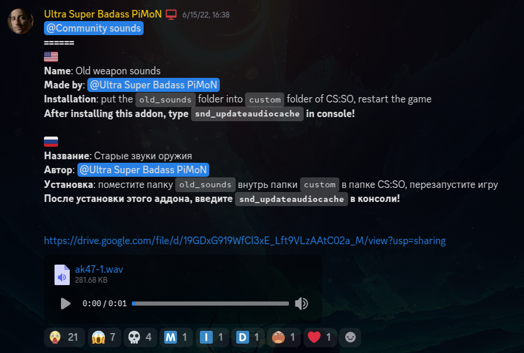

# Counter-Strike: Source Offensive Test Build - Old CS:GO Sounds

this project is basically porting the csgo old sounds community sound addon from CSSO 1.1 (image below) to the CSSO Test Builds.

the only differences is that this port uses the sound script based from the vanilla sound script and doesn't use recompiled models.

---

## install?
1. download this entire repository (the only thing you need to worry is the big folder)
2. unzip the repository
3. find your csso installation (usually in the root of cs: source)
4. open csso's content folder (`csso`)
5. open the repository's folder
6. drag the `old_csgo_sounds` folder into `custom`
7. restart cs: source if you haven't already
8. happy banging noises 🎉

---

## credits
- **pimon** // the creator of this awesome cs: source mod and the original author for the sound addon
- **valve** // the sounds of the literal banging noises in your head

---

## progress report
### pistols
- [x] glock 18
- [x] p2000
- [x] usp
- [x] dual elites
- [x] p250
- [x] cz75-auto
- [x] five-seven
- [x] tec-9
- [x] desert eagle

> [!NOTE]
> the r8 revolver is an exception becuase it doesn't exist in csgo on launch. (not until 2015, prior to the weapon sound overhauls)

### heavy weapons
- [x] nova
- [x] xm1014
- [x] sawed-off
- [x] mag7
- [x] negev
- [x] m249

### submachines
- [x] mac10
- [x] mp9
- [x] mp7
- [x] ump-45
- [x] p90
- [x] pp-bizon

> [!NOTE]
> similar to the r8 revolver, the mp5 is an exception becuase it doesn't exist in csgo on launch. (not until 2018, after the weapon sound overhauls)

### rifles
- [x] galil ar
- [x] famas
- [x] ak-47
- [x] m4a4
- [x] m4a1-s
- [x] ssg 08
- [x] sg 553
- [x] aug
- [x] awp
- [x] g3sg1
- [x] scar-20

### grenades and other equipment
- [x] he
- [x] decoy
- [x] flashbang
- [x] smoke
- [x] molotov
- [x] incendiary
- [x] c4